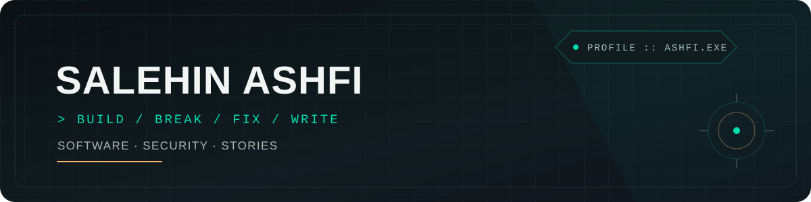
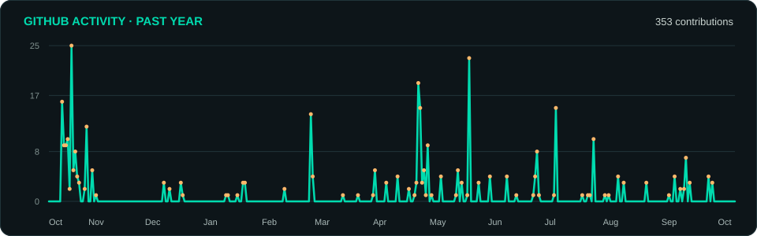

 

### Programmer · Security Researcher · Writer

*I build, break, fix, and write — sometimes all at once.*

🖤 Code, coffee, and curiosity.

I’m a security researcher, Python tinkerer, and storyteller. I explore the digital world like a puzzle, look for weaknesses like a detective, and leave behind tools, scripts, and stories for the curious.

---

## 🏆 Trophies

  

---

## 📊 GitHub stats

  
  

  

  

  

---

## 🐍 Contribution snake

  <picture>
    <source media="(prefers-color-scheme: dark)" srcset="https://raw.githubusercontent.com/ashfiexe/ashfiexe/output/github-contribution-grid-snake-dark.svg" />
    <source media="(prefers-color-scheme: light)" srcset="https://raw.githubusercontent.com/ashfiexe/ashfiexe/output/github-contribution-grid-snake.svg" />
    
  </picture>

---

## 🛠 Languages & tools

  
    
  
    
  
    
  
    
  

---

## 🎧 Now playing

 

 

 

 

 

---

## 🌐 Connect

---

## ☕ Support

  

